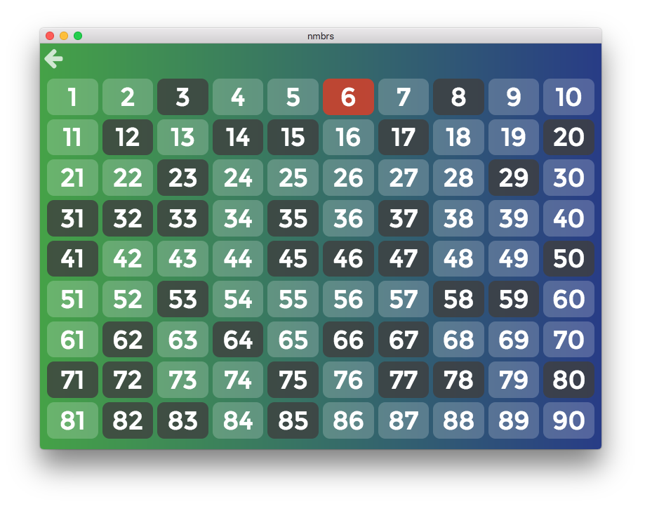
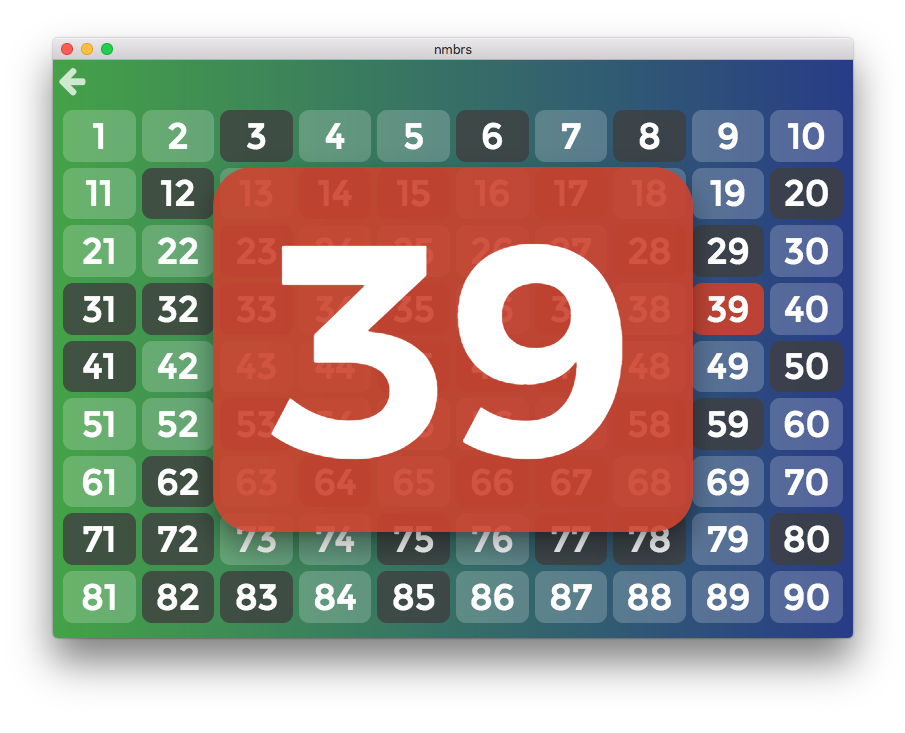

# nmbrs

***nmbrs*** is a lotto board created to show the current results of a round. It's a 9x10 table with numbers 1-90. The previous numbers cells are marked with a grey while the last one is marked with red.

In order to mark a new number, the number cell should be pressed and a big red dialog will come up announcing the new number. It's shown for 5 seconds, but can be closed before by pressing it.

There's also the possibility of undoing by pressing the last number.

***nmbrs*** *has been developed using React and Electron. The state management is done using Redux. The project has been created from [electron-react-boilerplate](https://github.com/chentsulin/electron-react-boilerplate).*

     |  
:----------------------------:|:----------------------------:
Lotto board                   | New number dialog

---

***nmbrs*** és un tauler de bingo creat per mostrar els resultats actuals d'un ronda en les quines populars. És un tauler 9x10 amb números de l'1 al 90. Les cel·les dels números que ja han sortit estan marcades en gris excepte l'últim, que està marcat en vermell.

Per tal de marcar un nou número, cal prémer la seva cel·la i aleshores apareixerà un gran requadre vermell anunciant el nou número. Aquesta alerta dura 5 segons, però es pot tancar abans clicant-la.

També hi ha la possiblitat de desfer l'acció fent clic a l'últim número.

***nmbrs*** *ha estat desenvolupat amb React i Electron. La gestió de l'estat es duu a terme gràcies a Redux. El projecte s'ha creat a partir de l'[electron-react-boilerplate](https://github.com/chentsulin/electron-react-boilerplate).*

